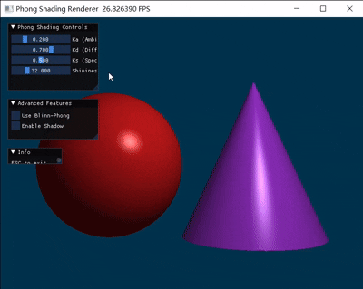

# Phong 光照模型渲染器

基于 Taichi 的实时光线投射渲染器，实现 Phong 和 Blinn-Phong 光照模型。

## 演示效果



## 项目结构

```
phong_shading/
├── renderer.py       # 主渲染程序
├── requirements.txt  # 依赖文件
└── README.md         # 本文件
```

## 安装与运行

### 1. 安装依赖

使用 uv 安装依赖：

```bash
uv pip install -r requirements.txt
```

或直接安装 Taichi：

```bash
uv pip install taichi
```

### 2. 运行程序

```bash
python renderer.py
```

## 功能特性

### 基础功能

- **光线投射渲染**：使用数学隐式定义几何体
  - 红色球体：圆心 (-1.2, -0.2, 0)，半径 1.2
  - 紫色圆锥：顶点 (1.2, 1.2, 0)，底面 y = -1.4，半径 1.2

- **深度测试 (Z-buffer)**：正确处理物体遮挡关系

- **Phong 光照模型**：
  - 环境光 (Ambient): $I_{ambient} = K_a \times C_{light} \times C_{object}$
  - 漫反射 (Diffuse): $I_{diffuse} = K_d \times \max(0, \mathbf{N} \cdot \mathbf{L}) \times C_{light} \times C_{object}$
  - 镜面高光 (Specular): $I_{specular} = K_s \times \max(0, \mathbf{R} \cdot \mathbf{V})^n \times C_{light}$

### 交互控制面板

程序运行时提供 4 个滑动条控件：

| 参数 | 范围 | 默认值 | 说明 |
|------|------|--------|------|
| Ka (环境光系数) | 0.0 ~ 1.0 | 0.2 | 控制环境光强度 |
| Kd (漫反射系数) | 0.0 ~ 1.0 | 0.7 | 控制漫反射强度 |
| Ks (镜面高光系数) | 0.0 ~ 1.0 | 0.5 | 控制镜面高光强度 |
| Shininess (高光指数) | 1.0 ~ 128.0 | 32.0 | 控制高光区域大小 |

### 附加功能

1. **Blinn-Phong 模型**：
   - 通过 UI 切换使用半程向量 $\mathbf{H}$ 计算镜面高光
   - 公式: $I_{specular} = K_s \times \max(0, \mathbf{N} \cdot \mathbf{H})^n \times C_{light}$
   - 与 Phong 模型的区别：在高光区域边缘（大入射角时）更加平滑

2. **硬阴影 (Hard Shadow)**：
   - 通过 UI 启用/禁用
   - 使用阴影射线检测遮挡关系
   - 被遮挡区域仅显示环境光

## 场景设置

- **摄像机位置**：(0, 0, 5)
- **光源位置**：(2, 3, 4)，白光 (1.0, 1.0, 1.0)
- **背景颜色**：深青色 (0.0, 0.2, 0.3)

## 技术要点

### 向量归一化

所有参与点乘的向量都已归一化为单位向量：
- $\mathbf{N}$：表面法向量
- $\mathbf{L}$：指向光源的方向向量
- $\mathbf{V}$：指向摄像机的方向向量
- $\mathbf{R}$：光线的理想反射向量

### 数值处理

- 使用 `ti.max(0.0, dot_product)` 截断负值，避免非法运算
- 使用 `ti.math.clamp(color, 0.0, 1.0)` 限制颜色范围防止过曝

## 退出程序

按 `ESC` 键退出渲染窗口。
